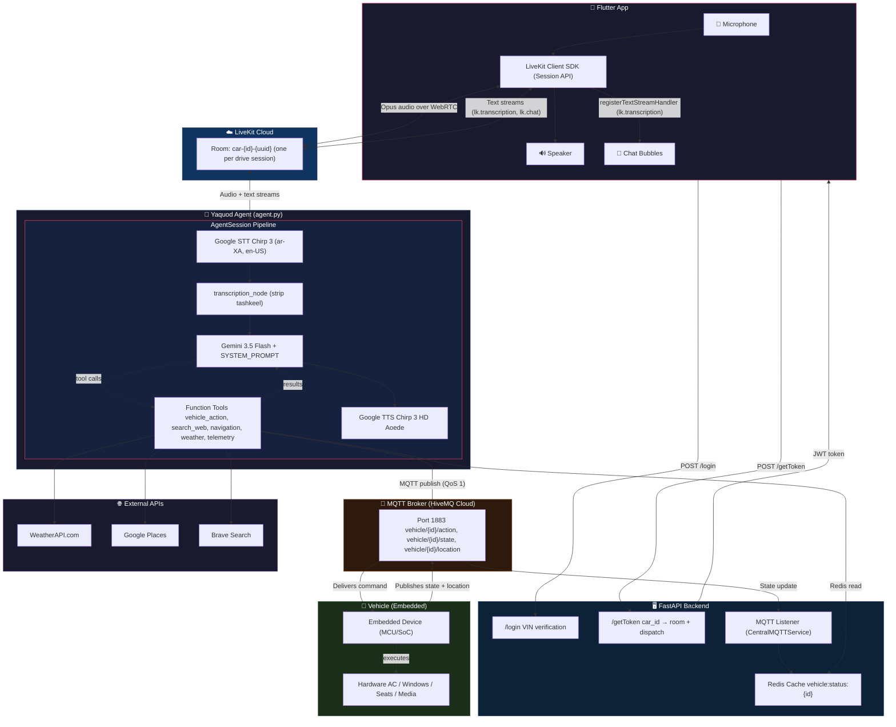
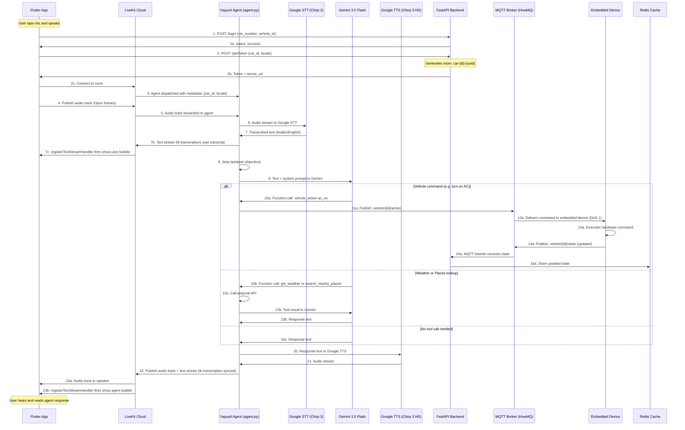

# Yaquod Voice Agent — Complete Integration Guide

**Document Version:** 2.0  
**Classification:** Full-Stack Technical Integration  
**Target Audience:** Embedded Engineering Team & Flutter Mobile Team  
**Date:** July 14, 2026  
**Source:** [`Yaquod/Voice-Agent-Yaquod`](https://github.com/Yaquod/Voice-Agent-Yaquod) — `main` branch  
**Status:** Complete & Production-Ready

---

## Table of Contents

1. [Executive Summary](#executive-summary)
2. [System Architecture](#system-architecture)
3. [End-to-End Voice Pipeline](#end-to-end-voice-pipeline)
4. [Part A — Embedded Device Integration](#part-a--embedded-device-integration)
   - [A.1 Integration Flow](#a1-integration-flow)
   - [A.2 Authentication Protocol](#a2-authentication-protocol)
   - [A.3 MQTT Communication](#a3-mqtt-communication)
   - [A.4 Message Schemas & Validation](#a4-message-schemas--validation)
   - [A.5 Vehicle Commands](#a5-vehicle-commands)
   - [A.6 Telemetry Implementation](#a6-telemetry-implementation)
5. [Part B — Flutter App Integration](#part-b--flutter-app-integration)
   - [B.1 The Key Insight](#b1-the-key-insight)
   - [B.2 Token Server (Backend Endpoint)](#b2-token-server-backend-endpoint)
   - [B.3 Flutter Session API](#b3-flutter-session-api)
   - [B.4 Real-Time Transcription Display](#b4-real-time-transcription-display)
   - [B.5 Interactive Buttons & Custom UI Data](#b5-interactive-buttons--custom-ui-data)
   - [B.6 RPC for Request-Response Interactions](#b6-rpc-for-request-response-interactions)
6. [Configuration & Constants](#configuration--constants)
7. [Implementation Checklist](#implementation-checklist)
8. [Error Recovery](#error-recovery)
9. [Debugging & Diagnostics](#debugging--diagnostics)

---

## Executive Summary

The Yaquod Voice Agent is a bilingual (Arabic/English) real-time voice AI assistant for autonomous vehicles. It is powered by **LiveKit Agents** with **Google Cloud STT (Chirp 3)**, **Google Cloud TTS (Chirp 3 HD)**, and **Google Gemini 3.5 Flash** LLM.

There are **two client integration points**:

| Client                                   | Role                                                       | Protocol         |
| ---------------------------------------- | ---------------------------------------------------------- | ---------------- |
| **Embedded Device** (in-vehicle MCU/SoC) | Receives vehicle commands, publishes telemetry & location  | MQTT over TLS    |
| **Flutter App** (passenger mobile app)   | Captures voice, displays transcriptions, plays agent audio | LiveKit (WebRTC) |

### What the Embedded Device Must Do

1. **Authenticate** via HTTP (`POST /login`) with VIN credentials
2. **Connect** to MQTT broker with TLS/SSL
3. **Subscribe** to 3 command topics
4. **Publish** vehicle state every 5–10 seconds
5. **Publish** location every 2–5 seconds (when moving)
6. **Execute** 23 allowed vehicle actions
7. **Validate** all incoming commands
8. **Handle** reconnections automatically

### What the Flutter App Must Do

1. **Call** `POST /login` to authenticate the vehicle (VIN-based)
2. **Call** `POST /getToken` to get a LiveKit JWT and server URL
3. **Connect** to a LiveKit Room using the Session API
4. **Enable** the microphone to publish audio
5. **Register** `lk.transcription` text stream handler for chat bubbles
6. **Play** agent audio (handled by LiveKit automatically)
7. **Optionally** send text input via `lk.chat` topic

---

## System Architecture

### Communication Channels

| Channel           | Protocol | Port | Direction                  | Security    |
| ----------------- | -------- | ---- | -------------------------- | ----------- |
| **Vehicle Login** | HTTP     | 8081 | Embedded/Flutter → Backend | TLS (prod)  |
| **LiveKit Token** | HTTP     | 8081 | Flutter → Backend          | TLS (prod)  |
| **Voice Session** | WebRTC   | 443  | Flutter ↔ LiveKit ↔ Agent  | DTLS/SRTP   |
| **Commands**      | MQTT     | 1883 | Backend → Embedded         | Unencrypted |
| **Telemetry**     | MQTT     | 1883 | Embedded → Backend         | Unencrypted |
| **State Cache**   | Redis    | 6380 | Internal backend           | Local only  |

### Architecture Diagram



---

## End-to-End Voice Pipeline

This is the complete flow from the user speaking in the Flutter app to a vehicle command being executed on the embedded device:



### Key Design Insight

The agent communicates with the embedded device **directly via MQTT** (not through HTTP). The `CentralMQTTService` in `agent.py` maintains a persistent MQTT connection and publishes commands to topics like `vehicle/{vehicle_id}/action`. The same service subscribes to `vehicle/+/state` and `vehicle/+/location` to receive telemetry, which is merged and stored in Redis for the agent to read on-demand.

---

## Part A — Embedded Device Integration

### A.1 Integration Flow

#### Startup Sequence

```
Device Powers On
    |
    +-- Load Configuration
    |   +-- MQTT Broker: yaquod.duckdns.org:1883
    |   +-- MQTT Username / Password
    |   +-- Backend URL: https://yaquod-agent.fastapicloud.dev
    |
    +-- HTTP Login Request (30s timeout, retry 5x with backoff)
    |   POST /login
    |   {
    |     "vehicle_id": "vehicle_001",
    |     "vin_number": "VIN_12345"
    |   }
    |   Response: HTTP 200 {"status": "success", "message": "Authenticated", "vehicle_id": "vehicle_001"}
    |
    +-- Establish MQTT Connection
    |   Connect to broker
    |   Authenticate with username/password
    |   Set keepalive to 60 seconds
    |   Wait for CONNACK
    |
    +-- Subscribe to Command Topics (QoS 1)
    |   SUBSCRIBE vehicle/vehicle_001/action
    |   SUBSCRIBE vehicle/vehicle_001/navigation/change
    |   SUBSCRIBE vehicle/vehicle_001/navigation/cancel
    |   Wait for SUBACK
    |
    +-- Publish Initial State
    |   PUBLISH vehicle/vehicle_001/state
    |   Payload: Full vehicle state JSON (include vin_number for backend auth)
    |   QoS: 1, Retain: false
    |
    +-- Begin Event Loop
        +-- Listen for incoming MQTT messages
        +-- Execute commands
        +-- Update state
        +-- Publish telemetry every 5-10s
        +-- Publish location every 2-5s
        +-- Handle reconnections
```

> [!IMPORTANT]
> The backend validates every incoming MQTT state/location message by checking the `vin_number` field against the authenticated session stored in Redis. Messages from unauthenticated vehicles are silently dropped (see `data_handling_service.py`).

#### Command Execution Flow

```
MQTT message arrives: vehicle/vehicle_001/action
    |
    +-- Parse JSON payload
    |
    +-- Validate
    |   +-- Extract "action" field
    |   +-- Check against ALLOWED_ACTIONS (23 total)
    |   +-- Extract "parameters" dict
    |   +-- Validate each parameter
    |
    +-- On Valid Command
    |   +-- Execute hardware command
    |   +-- Update internal state
    |   +-- Publish state update
    |
    +-- On Invalid Command
        +-- Log error
        +-- Do NOT execute
        +-- Continue listening
```

---

### A.2 Authentication Protocol

#### HTTP Login Endpoint

**URL:** `POST https://yaquod-agent.fastapicloud.dev/login`  
**Content-Type:** `application/json`  
**Timeout:** 30 seconds

#### Request Format

```json
{
  "vehicle_id": "vehicle_001",
  "vin_number": "VIN_12345"
}
```

| Field        | Type   | Required | Description                                                                       |
| ------------ | ------ | -------- | --------------------------------------------------------------------------------- |
| `vehicle_id` | string | Yes      | Vehicle identifier (e.g., `vehicle_001`)                                          |
| `vin_number` | string | Yes      | Vehicle Identification Number — validated against backend API and static fallback |

> [!NOTE]
> The backend's `validation_service.py` first tries to verify the VIN against an external API (`https://yaquod.duckdns.org/api/vehicles/verify/{vin}`). If that fails (timeout, connection error), it falls back to static validation: `vin == "VIN_12345"`.

#### Response Format (Success)

**HTTP Status:** 200 OK

```json
{
  "status": "success",
  "message": "Authenticated",
  "vehicle_id": "vehicle_001"
}
```

#### Response Format (Failure)

**HTTP Status:** 401 Unauthorized

```json
{
  "detail": "Invalid VIN Number"
}
```

#### Backend Implementation

```python
# routes/models/login_request_model.py
class LoginRequest(BaseModel):
    vehicle_id: str
    vin_number: str

# routes/vehicle_api.py -- POST /login
async def login(data: LoginRequest):
    is_valid, error = validate_vehicle(data.vin_number)
    if not is_valid:
        raise HTTPException(status_code=401, detail=error)
    
    # Store auth state in Redis
    redis_client.set(
        f"vehicle:auth:{data.vin_number}",
        json.dumps({"status": "authenticated", "vehicle_id": data.vehicle_id}),
    )
    redis_client.set(f"vehicle:map:{data.vehicle_id}", data.vin_number, ex=3600)
    
    return {"status": "success", "message": "Authenticated", "vehicle_id": data.vehicle_id}
```

#### Retry Strategy

```
Attempt 1: Immediate
Attempt 2: Wait 1 second
Attempt 3: Wait 2 seconds
Attempt 4: Wait 4 seconds
Attempt 5: Wait 8 seconds

If all 5 attempts fail:
  -> Log error
  -> Try MQTT connection anyway (may have cached auth)
  -> Retry login every 30 seconds indefinitely
```

---

### A.3 MQTT Communication

#### Broker Configuration

| Setting           | Value                                                                 |
| ----------------- | --------------------------------------------------------------------- |
| **Hostname**      | Set via `MQTT_HOST` environment variable (e.g., `yaquod.duckdns.org`) |
| **Port**          | Set via `MQTT_PORT` (`1883` for non-TLS)                              |
| **Protocol**      | MQTT 3.1.1                                                            |
| **TLS Version**   | Not required for port 1883 (or 1.2+ if using SSL)                     |
| **Username**      | Set via `MQTT_USERNAME`                                               |
| **Password**      | Set via `MQTT_PASSWORD`                                               |
| **Keepalive**     | 60 seconds                                                            |
| **Clean Session** | true                                                                  |

#### Backend MQTT Implementation

The backend uses `aiomqtt` with a persistent connection managed by `CentralMQTTService`:

```python
# services/mqtt_service.py (simplified)
class CentralMQTTService:
    async def _connect_and_run(self):
        use_ssl = os.environ.get("MQTT_SSL", "false").lower() == "true"
        tls_context = ssl.create_default_context() if use_ssl else None
        
        while True:
            try:
                async with aiomqtt.Client(
                    hostname=mqtt_host,
                    port=mqtt_port,
                    username=mqtt_username,
                    password=mqtt_password,
                    tls_context=tls_context,
                ) as client:
                    self.client = client
                    await client.subscribe("vehicle/+/state")
                    await client.subscribe("vehicle/+/location")
                    
                    async for message in client.messages:
                        await handle_vehicle_message(
                            message.topic.value, message.payload, self.r_client
                        )
            except Exception:
                await asyncio.sleep(5)  # Reconnect after 5 seconds

    async def publish_action(self, car_id, topic_suffix, payload):
        topic = f"vehicle/{car_id}/{topic_suffix}"
        await self.client.publish(topic, json.dumps(payload))
```

#### Topic Structure

All topics follow the pattern: `vehicle/{vehicle_id}/{topic_type}/{optional_subtype}`

| Topic                            | Direction           | Purpose                       |
| -------------------------------- | ------------------- | ----------------------------- |
| `vehicle/{id}/action`            | Backend -> Embedded | Vehicle control commands      |
| `vehicle/{id}/navigation/change` | Backend -> Embedded | Navigation destination change |
| `vehicle/{id}/navigation/cancel` | Backend -> Embedded | Cancel current navigation     |
| `vehicle/{id}/state`             | Embedded -> Backend | Vehicle status telemetry      |
| `vehicle/{id}/location`          | Embedded -> Backend | GPS and trip info             |

---

### A.4 Message Schemas & Validation

#### Vehicle Action Command

**Topic:** `vehicle/{vehicle_id}/action`  
**Direction:** Backend -> Embedded  
**QoS:** 1 | **Retain:** false

```json
{
  "vehicle_id": "vehicle_001",
  "action": "ac_on",
  "parameters": {}
}
```

| Field        | Type   | Required | Description                                       |
| ------------ | ------ | -------- | ------------------------------------------------- |
| `vehicle_id` | string | Yes      | The vehicle identifier                            |
| `action`     | string | Yes      | Action to execute — must be in `ALLOWED_ACTIONS`  |
| `parameters` | object | Yes      | Action-specific parameters (see Vehicle Commands) |

**JSON Schema:**
```json
{
  "type": "object",
  "required": ["vehicle_id", "action", "parameters"],
  "additionalProperties": false,
  "properties": {
    "vehicle_id": { "type": "string" },
    "action": {
      "type": "string",
      "enum": [
        "ac_on", "ac_off", "set_temperature", "set_fan_speed",
        "set_airflow_mode", "climate_auto", "climate_sync",
        "window_open", "window_close", "window_lock", "window_unlock",
        "music_play", "music_pause", "set_volume", "next_track",
        "previous_track", "reading_light_on", "reading_light_off",
        "safe_stop", "seat_position", "seat_recline", "seat_height"
      ]
    },
    "parameters": { "type": "object" }
  }
}
```

#### Navigation Change Command

**Topic:** `vehicle/{vehicle_id}/navigation/change`  
**Direction:** Backend -> Embedded  
**QoS:** 1 | **Retain:** false

```json
{
  "vehicle_id": "vehicle_001",
  "destination": "Cairo Tower",
  "latitude": 30.0444,
  "longitude": 31.2357
}
```

| Field         | Type   | Required | Range       | Description                            |
| ------------- | ------ | -------- | ----------- | -------------------------------------- |
| `vehicle_id`  | string | Yes      | —           | Vehicle identifier                     |
| `destination` | string | Yes      | 1-255 chars | Place name (resolved by Google Places) |
| `latitude`    | number | Yes      | [-90, 90]   | Destination latitude                   |
| `longitude`   | number | Yes      | [-180, 180] | Destination longitude                  |

#### Navigation Cancel Command

**Topic:** `vehicle/{vehicle_id}/navigation/cancel`  
**Direction:** Backend -> Embedded  
**QoS:** 1 | **Retain:** false

```json
{
  "vehicle_id": "vehicle_001"
}
```

#### Vehicle State Publication (Embedded -> Backend)

**Topic:** `vehicle/{vehicle_id}/state`  
**Direction:** Embedded -> Backend  
**QoS:** 1 | **Retain:** false  
**Frequency:** Every 5-10 seconds

> [!IMPORTANT]
> The `vin_number` field **must** be included in every state and location message. The backend uses it to authenticate the source: `data_handling_service.py` calls `validate_authenticated_vehicle(r_client, vin_number, vehicle_id)` — if the VIN/vehicle_id pair does not match an authenticated session in Redis, the message is silently dropped.

**Comprehensive Schema:**
```json
{
  "vehicle_id": "vehicle_001",
  "vin_number": "VIN_12345",
  "timestamp": 1720592410,
  "vehicle_model": "Tesla Model Y",
  "vehicle_color": "White",
  "plate_num": "ABC-123",
  "number_of_seats": 5,
  "battery_level": 85,
  "ac_status": "on",
  "ac_temperature": 22,
  "ac_fan_speed": 3,
  "ac_airflow_mode": "face",
  "ac_auto": true,
  "ac_sync": false,
  "window_status": {
    "front_left": 50,
    "front_right": 0,
    "rear_left": 0,
    "rear_right": 0
  },
  "window_lock_status": true,
  "music_status": true,
  "music_volume": 70,
  "reading_light_status": {
    "front": true,
    "rear": false
  },
  "seat_status": {
    "driver": {
      "position": 50,
      "recline": 20,
      "height": 80
    },
    "passenger": {
      "position": 50,
      "recline": 10,
      "height": 70
    }
  }
}
```

**Field Definitions:**

| Field                  | Type    | Required | Nullable | Range                     | Description                            |
| ---------------------- | ------- | -------- | -------- | ------------------------- | -------------------------------------- |
| `vehicle_id`           | string  | Yes      | No       | —                         | Vehicle identifier                     |
| `vin_number`           | string  | Yes      | No       | —                         | VIN (must match authenticated session) |
| `timestamp`            | integer | No       | No       | >= 0                      | Unix epoch seconds                     |
| `vehicle_model`        | string  | No       | Yes      | —                         | Vehicle model name                     |
| `vehicle_color`        | string  | No       | Yes      | —                         | Vehicle color                          |
| `plate_num`            | string  | No       | Yes      | —                         | License plate                          |
| `number_of_seats`      | integer | No       | Yes      | >= 0                      | Seat count                             |
| `battery_level`        | integer | No       | Yes      | 0-100                     | Battery percentage                     |
| `ac_status`            | string  | No       | Yes      | "on"/"off"                | AC state                               |
| `ac_temperature`       | number  | No       | Yes      | 16-30                     | AC temp (C)                            |
| `ac_fan_speed`         | integer | No       | Yes      | 0-5                       | Fan speed                              |
| `ac_airflow_mode`      | string  | No       | Yes      | "face"/"feet"/"face_feet" | Airflow mode                           |
| `ac_auto`              | boolean | No       | Yes      | —                         | Auto mode enabled                      |
| `ac_sync`              | boolean | No       | Yes      | —                         | Sync mode enabled                      |
| `window_status`        | object  | No       | Yes      | 0-100 per window          | Window percentage open                 |
| `window_lock_status`   | boolean | No       | Yes      | —                         | Windows locked                         |
| `music_status`         | boolean | No       | Yes      | —                         | Music playing                          |
| `music_volume`         | integer | No       | Yes      | 0-100                     | Volume percentage                      |
| `reading_light_status` | object  | No       | Yes      | —                         | Light on/off per position              |
| `seat_status`          | object  | No       | Yes      | —                         | Seat adjustments per seat              |

#### Location & Trip Data (Embedded -> Backend)

**Topic:** `vehicle/{vehicle_id}/location`  
**Direction:** Embedded -> Backend  
**QoS:** 1 | **Retain:** false  
**Frequency:** Every 2-5 seconds (when moving)

```json
{
  "vehicle_id": "vehicle_001",
  "vin_number": "VIN_12345",
  "lat": 30.0444,
  "long": 31.2357,
  "speed": 45.5,
  "remaining_distance": 5200,
  "remaining_time": 720,
  "pickup_point_name": "Downtown Cairo",
  "destination_name": "Cairo Tower",
  "expected_trip_duration": 900
}
```

| Field                    | Type   | Required | Range       | Unit    | Description            |
| ------------------------ | ------ | -------- | ----------- | ------- | ---------------------- |
| `vehicle_id`             | string | Yes      | —           | —       | Vehicle identifier     |
| `vin_number`             | string | Yes      | —           | —       | VIN for authentication |
| `lat`                    | number | Yes      | [-90, 90]   | degrees | Latitude               |
| `long`                   | number | Yes      | [-180, 180] | degrees | Longitude              |
| `speed`                  | number | No       | [0, 300]    | km/h    | Current speed          |
| `remaining_distance`     | number | No       | >= 0        | meters  | To destination         |
| `remaining_time`         | number | No       | >= 0        | seconds | To destination         |
| `pickup_point_name`      | string | No       | —           | —       | Trip start name        |
| `destination_name`       | string | No       | —           | —       | Trip end name          |
| `expected_trip_duration` | number | No       | >= 0        | seconds | Total duration         |

#### Backend Data Processing

```
Device publishes to vehicle/{vehicle_id}/state or /location
  |
Backend MQTT listener (CentralMQTTService) receives
  |
data_handling_service.py:
  +-- Parse topic: extract vehicle_id and data_type
  +-- Parse JSON payload
  +-- Validate: check vin_number matches authenticated session in Redis
  +-- Retrieve previous state from Redis (vehicle:status:{vehicle_id})
  +-- Merge: new data overlays old (missing fields retained)
  +-- Validate via VehicleData Pydantic model
  +-- Strip vin_number from stored data
  +-- Store in Redis: vehicle:status:{vehicle_id}
```

---

### A.5 Vehicle Commands

All 23 allowed actions organized by category:

#### Climate Control (7 Actions)

| Action             | Parameters            | Constraints                                     | Purpose            |
| ------------------ | --------------------- | ----------------------------------------------- | ------------------ |
| `ac_on`            | `{}`                  | None                                            | Turn AC on         |
| `ac_off`           | `{}`                  | None                                            | Turn AC off        |
| `set_temperature`  | `zone`, `temperature` | zone in {left, right, both}, temp in [16, 30] C | Set AC target temp |
| `set_fan_speed`    | `speed`               | speed in {0, 1, 2, 3, 4, 5}                     | Set blower speed   |
| `set_airflow_mode` | `mode`                | mode in {face, feet, face_feet}                 | Set vent mode      |
| `climate_auto`     | `enabled`             | boolean                                         | Toggle auto mode   |
| `climate_sync`     | `enabled`             | boolean                                         | Toggle sync mode   |

**Examples:**
```json
{"vehicle_id":"vehicle_001","action":"ac_on","parameters":{}}
{"vehicle_id":"vehicle_001","action":"set_temperature","parameters":{"zone":"left","temperature":22}}
{"vehicle_id":"vehicle_001","action":"set_fan_speed","parameters":{"speed":3}}
{"vehicle_id":"vehicle_001","action":"set_airflow_mode","parameters":{"mode":"face_feet"}}
{"vehicle_id":"vehicle_001","action":"climate_auto","parameters":{"enabled":true}}
```

#### Window Control (4 Actions)

| Action          | Parameters             | Constraints                                                                      | Purpose            |
| --------------- | ---------------------- | -------------------------------------------------------------------------------- | ------------------ |
| `window_open`   | `window`, `percentage` | window in {all, front_left, front_right, rear_left, rear_right}, pct in [0, 100] | Open window to %   |
| `window_close`  | `window`, `percentage` | Same as above                                                                    | Close window to %  |
| `window_lock`   | `{}`                   | None                                                                             | Lock all windows   |
| `window_unlock` | `{}`                   | None                                                                             | Unlock all windows |

**Examples:**
```json
{"vehicle_id":"vehicle_001","action":"window_open","parameters":{"window":"front_left","percentage":50}}
{"vehicle_id":"vehicle_001","action":"window_lock","parameters":{}}
```

#### Media Control (5 Actions)

| Action           | Parameters | Constraints           | Purpose                                        |
| ---------------- | ---------- | --------------------- | ---------------------------------------------- |
| `music_play`     | `{}`       | None                  | Resume playback                                |
| `music_pause`    | `{}`       | None                  | Pause playback                                 |
| `next_track`     | `{}`       | None                  | Skip to next song                              |
| `previous_track` | `{}`       | None                  | Go to previous song                            |
| `set_volume`     | `change`   | change in [-100, 100] | Adjust volume (positive = up, negative = down) |

**Examples:**
```json
{"vehicle_id":"vehicle_001","action":"music_play","parameters":{}}
{"vehicle_id":"vehicle_001","action":"set_volume","parameters":{"change":10}}
{"vehicle_id":"vehicle_001","action":"set_volume","parameters":{"change":-5}}
```

#### Lighting (2 Actions)

| Action              | Parameters | Constraints                  | Purpose                 |
| ------------------- | ---------- | ---------------------------- | ----------------------- |
| `reading_light_on`  | `light`    | light in {front, rear, both} | Turn reading lights on  |
| `reading_light_off` | `light`    | light in {front, rear, both} | Turn reading lights off |

**Examples:**
```json
{"vehicle_id":"vehicle_001","action":"reading_light_on","parameters":{"light":"front"}}
{"vehicle_id":"vehicle_001","action":"reading_light_off","parameters":{"light":"both"}}
```

#### Seat Control (3 Actions)

| Action          | Parameters           | Constraints                                    | Purpose            |
| --------------- | -------------------- | ---------------------------------------------- | ------------------ |
| `seat_position` | `seat`, `percentage` | seat in {driver, passenger}, pct in [0, 100]   | Slide forward/back |
| `seat_recline`  | `seat`, `percentage` | seat in {driver, passenger}, pct in [-90, 100] | Recline backrest   |
| `seat_height`   | `seat`, `percentage` | seat in {driver, passenger}, pct in [0, 100]   | Adjust height      |

**Examples:**
```json
{"vehicle_id":"vehicle_001","action":"seat_position","parameters":{"seat":"driver","percentage":75}}
{"vehicle_id":"vehicle_001","action":"seat_recline","parameters":{"seat":"driver","percentage":45}}
{"vehicle_id":"vehicle_001","action":"seat_height","parameters":{"seat":"passenger","percentage":60}}
```

#### Safety (1 Action)

| Action      | Parameters | Constraints | Purpose             |
| ----------- | ---------- | ----------- | ------------------- |
| `safe_stop` | `{}`       | None        | Emergency safe stop |

```json
{"vehicle_id":"vehicle_001","action":"safe_stop","parameters":{}}
```

#### ALLOWED_ACTIONS Complete Set

```python
ALLOWED_ACTIONS = {
    # Climate
    "ac_on", "ac_off", "set_temperature", "set_fan_speed",
    "set_airflow_mode", "climate_auto", "climate_sync",
    # Windows
    "window_open", "window_close", "window_lock", "window_unlock",
    # Music
    "music_play", "music_pause", "set_volume",
    "next_track", "previous_track",
    # Lights
    "reading_light_on", "reading_light_off",
    # Seats
    "seat_position", "seat_recline", "seat_height",
    # Safety
    "safe_stop"
}
# Total: 23 actions
```

#### FORBIDDEN Actions

**NEVER implement — these are explicitly blocked by the agent's LLM prompt:**
```
X accelerate
X brake
X steer
X lane_change
X override_driving
X disable_safety
X emergency_call
```

---

### A.6 Telemetry Implementation

#### State Update Cycle

```
Device maintains internal state
  |
Timer: Every 5-10 seconds
  +-- Serialize current state (include vin_number)
  +-- Increment timestamp
  +-- Publish to vehicle/{vehicle_id}/state

Timer: Every 2-5 seconds (when moving)
  +-- Get current GPS coordinates
  +-- Calculate trip progress
  +-- Publish to vehicle/{vehicle_id}/location (include vin_number)
```

#### Fields Used by Voice Agent

The agent has three telemetry query tools that read from Redis:

| Agent Query                            | Tool Called                  | Fields Used                                                                                                        |
| -------------------------------------- | ---------------------------- | ------------------------------------------------------------------------------------------------------------------ |
| "What car is this?" / "Battery level?" | `get_vehicle_core_telemetry` | `vehicle_model`, `vehicle_color`, `plate_num`, `battery_level`, `number_of_seats`                                  |
| "Where are we going?" / "ETA?"         | `get_vehicle_trip_profile`   | `pickup_point_name`, `destination_name`, `expected_trip_duration`, `remaining_distance`, `remaining_time`, `speed` |
| "What is the cabin status?"            | `get_cabin_systems_status`   | All AC, window, music, light, seat fields                                                                          |
| Weather/time queries                   | `get_weather_and_time`       | `lat`, `long` (from Redis, falls back to Cairo default)                                                            |

---

## Part B — Flutter App Integration

### B.1 The Key Insight

**You do NOT send raw audio bytes directly from Flutter to your agent via HTTP/WebSocket yourself.** LiveKit handles all of that. Your Flutter app joins a **LiveKit Room** as a participant, and your agent (running as a persistent worker via `python agent.py start`) joins the same room. LiveKit's infrastructure manages the real-time audio transport between them.

**Each drive session gets its own isolated room**, named `car-{car_id}-{uuid}` (generated server-side). The agent is explicitly dispatched with the car's identity baked into its job metadata.

> [!IMPORTANT]
> You do **NOT** need to:
> - Manually capture PCM/WAV bytes in Flutter
> - Send audio over a custom WebSocket
> - Handle encoding/decoding yourself
> - Call any STT endpoint from Flutter
>
> LiveKit abstracts all of this. Your Flutter app uses the `Session` API to connect and enable the mic. The agent's `AgentSession` handles STT -> LLM -> TTS -> audio output automatically.

---

### B.2 Token Server (Backend Endpoint)

The Flutter app must first authenticate (login), then get a LiveKit token:

#### Step 1: Login

```
POST /login
Content-Type: application/json

{
  "vehicle_id": "vehicle_001",
  "vin_number": "VIN_12345"
}
```

**Response (200):**
```json
{
  "status": "success",
  "message": "Authenticated",
  "vehicle_id": "vehicle_001"
}
```

#### Step 2: Get Token

```
POST /getToken
Content-Type: application/json

{
  "car_id": "vehicle_001",
  "locale": "ar"
}
```

| Field    | Type   | Required | Default | Description                     |
| -------- | ------ | -------- | ------- | ------------------------------- |
| `car_id` | string | Yes      | —       | Vehicle identifier (min 1 char) |
| `locale` | string | No       | `"ar"`  | Language locale                 |

> [!NOTE]
> The `/getToken` endpoint validates that the vehicle has authenticated by checking `vehicle:map:{car_id}` in Redis. If the vehicle has not called `/login` first, it returns a 401 error: `"Vehicle '{car_id}' has not authenticated. The embedded device must call POST /login first."`

**Response (200):**
```json
{
  "server_url": "wss://your-livekit-url",
  "participant_token": "<JWT>"
}
```

#### Backend Implementation Detail

```python
# routes/vehicle_api.py -- POST /getToken
async def get_token(request: TokenRequest):
    # 1. Check authentication
    mapped_vin = redis_client.get(f"vehicle:map:{request.car_id}")
    if not mapped_vin:
        raise HTTPException(status_code=401, detail="Vehicle has not authenticated")

    # 2. Generate unique room per session
    room_name = f"car-{request.car_id}-{uuid.uuid4()}"
    participant_identity = f"car-{request.car_id}"

    # 3. Dispatch agent with car metadata
    metadata_json = json.dumps({"car_id": request.car_id, "locale": request.locale})
    room_config = api.RoomConfiguration(
        agents=[api.RoomAgentDispatch(agent_name="yaquod", metadata=metadata_json)],
        departure_timeout=300,
    )

    # 4. Create token
    token = (
        api.AccessToken(api_key, api_secret)
        .with_identity(participant_identity)
        .with_name(f"Car {request.car_id}")
        .with_grants(api.VideoGrants(room_join=True, room=room_name))
        .with_room_config(room_config)
        .to_jwt()
    )

    return {"server_url": server_url, "participant_token": token}
```

---

### B.3 Flutter Session API

LiveKit's Flutter SDK has a **Session API** that handles token fetching, room connection, and agent dispatch in one call:

```dart
import 'package:livekit_client/livekit_client.dart' as sdk;

// 1. Create a token source pointing to your backend
final tokenSource = sdk.EndpointTokenSource(
  url: Uri.parse("https://yaquod-agent.fastapicloud.dev/getToken"),
  headers: {'Authorization': 'Bearer ${getUserAuthToken()}'},
);

// 2. Create a session with agent name matching your agent.py
final session = sdk.Session.fromConfigurableTokenSource(
  tokenSource,
  const TokenRequestOptions(agentName: "yaquod"),
);

// 3. Start -- connects to room + dispatches agent automatically
await session.start();

// 4. Enable mic -- publishes your audio track
// (handled automatically by session if mic permission granted)

// 5. Listen for transcriptions (user speech + agent response)
session.room.registerTextStreamHandler('lk.transcription',
    (sdk.TextStreamReader reader, String participantIdentity) async {
  final message = await reader.readAll();
  final isFinal = reader.info?.attributes['lk.transcription_final'] == 'true';
  final segmentId = reader.info?.attributes['lk.segment_id'];
  final isUser = participantIdentity == session.room.localParticipant?.identity;

  // Update your UI with the transcription
  setState(() {
    // Add/update chat bubble (see next section for full impl)
  });
});

// 6. Send text input to agent
await session.sendText("lock the car");

// 7. End session when done
await session.end();
```

> [!TIP]
> The `agentName: "yaquod"` in `TokenRequestOptions` must match the `agent_name="yaquod"` in `agent.py`'s `@server.rtc_session(agent_name="yaquod")` decorator.

---

### B.4 Real-Time Transcription Display

The `AgentSession` in `agent.py` **automatically publishes transcription text streams** for both user speech (as Google STT transcribes it) and agent response (synchronized with TTS audio playback). You just need to listen for them in Flutter.

```dart
import 'package:livekit_client/livekit_client.dart';

class VoiceAgentScreen extends StatefulWidget {
  @override
  _VoiceAgentScreenState createState() => _VoiceAgentScreenState();
}

class _VoiceAgentScreenState extends State<VoiceAgentScreen> {
  Room? _room;
  final List<ChatMessage> _messages = [];
  final Map<String, int> _segmentIndexMap = {};

  @override
  void initState() {
    super.initState();
    _connectToRoom();
  }

  Future<void> _connectToRoom() async {
    _room = Room();

    // Register text stream handler BEFORE connecting
    _room!.registerTextStreamHandler('lk.transcription',
        (TextStreamReader reader, String participantIdentity) async {
      final message = await reader.readAll();

      final isTranscription =
          reader.info?.attributes['lk.transcribed_track_id'] != null;
      final isFinal =
          reader.info?.attributes['lk.transcription_final'] == 'true';
      final segmentId = reader.info?.attributes['lk.segment_id'];
      final isUser =
          participantIdentity == _room!.localParticipant?.identity;

      if (!isTranscription) return;

      setState(() {
        if (segmentId != null && _segmentIndexMap.containsKey(segmentId)) {
          // Replace interim message with the final one
          final index = _segmentIndexMap[segmentId]!;
          _messages[index] = ChatMessage(
            sender: isUser ? 'user' : 'agent',
            text: message,
            isFinal: isFinal,
          );
        } else {
          // New segment -- add a new message
          _messages.add(ChatMessage(
            sender: isUser ? 'user' : 'agent',
            text: message,
            isFinal: isFinal,
          ));
          if (segmentId != null) {
            _segmentIndexMap[segmentId] = _messages.length - 1;
          }
        }

        if (isFinal && segmentId != null) {
          _segmentIndexMap.remove(segmentId);
        }
      });
    });

    // Connect to LiveKit with your token
    final token = await _fetchToken();
    await _room!.connect('wss://your-livekit-url', token);
    await _room!.localParticipant?.setMicrophoneEnabled(true);
  }

  @override
  Widget build(BuildContext context) {
    return Scaffold(
      backgroundColor: const Color(0xFF0A1628),
      body: Column(
        children: [
          Expanded(
            child: ListView.builder(
              itemCount: _messages.length,
              itemBuilder: (ctx, index) {
                final msg = _messages[index];
                return ChatBubble(
                  text: msg.text,
                  isUser: msg.sender == 'user',
                  isStreaming: !msg.isFinal,
                );
              },
            ),
          ),
          _buildMicButton(),
        ],
      ),
    );
  }
}

class ChatMessage {
  final String sender; // "user" or "agent"
  final String text;
  final bool isFinal;

  ChatMessage({
    required this.sender,
    required this.text,
    this.isFinal = false,
  });
}
```

#### Key Stream Attributes

| Attribute                 | Value                 | Purpose                                                              |
| ------------------------- | --------------------- | -------------------------------------------------------------------- |
| `lk.transcribed_track_id` | Track ID string       | Present when this is a transcription (not a plain text message)      |
| `lk.transcription_final`  | `"true"` or `"false"` | `false` = interim (still processing), `true` = final                 |
| `lk.segment_id`           | Segment ID string     | Shared between interim and final streams for the same speech segment |

The `participantIdentity` parameter tells you **who** the transcription belongs to:
- Matches `room.localParticipant?.identity` -> **user's** transcribed speech
- Otherwise -> **agent's** response text

> [!NOTE]
> With the per-vehicle dispatch design, the local participant identity is always `"car-{car_id}"` (set server-side in `/getToken`).

#### Interim vs Final Streams

For each speech segment, **two streams** are produced:

- **Interim stream** (`lk.transcription_final = "false"`): fired while the segment is being processed (live typing effect)
- **Final stream** (`lk.transcription_final = "true"`): fired when the segment is complete

They share the same `lk.segment_id`. Replace the interim message with the final one. For a simpler approach, skip interim streams:

```dart
// Only show final transcriptions (simpler approach)
if (isFinal) {
  setState(() {
    _messages.add(ChatMessage(
      sender: isUser ? 'user' : 'agent',
      text: message,
      isFinal: true,
    ));
  });
}
```

---

### B.5 Interactive Buttons & Custom UI Data

For structured UI data (e.g., restaurant option buttons), use **text streams with a custom topic**:

#### Flutter Side — Receive Structured Data

```dart
room.registerTextStreamHandler('ui_action',
    (TextStreamReader reader, String participantIdentity) async {
  final jsonString = await reader.readAll();
  final data = json.decode(jsonString);

  if (data['type'] == 'place_options') {
    setState(() {
      _messages.add(ChatMessage(
        sender: 'agent',
        text: data['message'],
        isFinal: true,
        options: (data['options'] as List)
            .map((o) => ActionOption(label: o['label'], value: o['value']))
            .toList(),
      ));
    });
  }
});
```

#### Flutter Side — Send User's Choice Back to Agent

```dart
void _onOptionSelected(String value) async {
  await _room!.localParticipant?.sendText(
    value,
    options: SendTextOptions(topic: 'lk.chat'),
  );
}
```

> [!TIP]
> Sending to the `lk.chat` topic is the standard way to send text input to the agent. The `AgentSession` already monitors `lk.chat` for incoming text messages and will process them automatically (interrupting current speech and generating a new response).

---

### B.6 RPC for Request-Response Interactions

If you need a **request-response** pattern (Flutter asks agent -> agent responds with data), use **RPC**:

#### Agent Side — Register RPC Method

```python
@room.local_participant.register_rpc_method("get_nearby_places")
async def handle_get_nearby_places(data: rtc.RpcInvocationData):
    query = data.payload  # e.g., "restaurants"
    # ... call Google Places API ...
    return json.dumps({"places": [...]})
```

#### Flutter Side — Call RPC Method

```dart
try {
  final response = await room.localParticipant?.performRpc(
    destinationIdentity: 'agent-identity',
    method: 'get_nearby_places',
    payload: 'restaurants',
  );
  final data = json.decode(response!);
  // Build UI from data...
} catch (e) {
  print('RPC call failed: $e');
}
```

---

## Configuration & Constants

### Environment Variables

| Variable                         | Description                                   | Example                            |
| -------------------------------- | --------------------------------------------- | ---------------------------------- |
| `LIVEKIT_URL`                    | LiveKit Cloud WebSocket URL                   | `wss://your-project.livekit.cloud` |
| `LIVEKIT_API_KEY`                | LiveKit Cloud API key                         |                                    |
| `LIVEKIT_API_SECRET`             | LiveKit Cloud API secret                      |                                    |
| `GOOGLE_APPLICATION_CREDENTIALS` | Path to GCP Service Account JSON              | `/path/to/key.json`                |
| `GOOGLE_CLOUD_PROJECT`           | Google Cloud Project ID                       |                                    |
| `GOOGLE_CLOUD_LOCATION`          | Vertex AI region                              | `europe-west2`                     |
| `GOOGLE_GENAI_USE_VERTEXAI`      | Force Vertex AI backend                       | `true`                             |
| `GOOGLE_MAPS_API_KEY`            | Google Maps Places API key                    |                                    |
| `WEATHER_API_KEY`                | WeatherAPI.com API key                        |                                    |
| `MQTT_HOST`                      | MQTT broker hostname                          | `yaquod.duckdns.org`               |
| `MQTT_PORT`                      | MQTT broker port                              | `1883`                             |
| `MQTT_USERNAME`                  | MQTT broker username                          |                                    |
| `MQTT_PASSWORD`                  | MQTT broker password                          |                                    |
| `MQTT_SSL`                       | Enable TLS for MQTT                           | `false`                            |
| `BRAVE_SEARCH_API_KEY`           | Brave Search API key                          |                                    |
| `REDIS_URL`                      | Redis connection URL                          | `redis://16.170.85.176:6380`       |
| `ACCESS_TOKEN`                   | Backend API access token (for VIN verify API) |                                    |

### Validation Constants (from `config/constants.py`)

```python
ALLOWED_ACTIONS = {
    # Climate
    "ac_on", "ac_off", "set_temperature", "set_fan_speed",
    "set_airflow_mode", "climate_auto", "climate_sync",
    # Windows
    "window_open", "window_close", "window_lock", "window_unlock",
    # Music
    "music_play", "music_pause", "set_volume",
    "next_track", "previous_track",
    # Lights
    "reading_light_on", "reading_light_off",
    # Seats
    "seat_position", "seat_recline", "seat_height",
    # Safety
    "safe_stop"
}
# Total: 23 actions

VALID_ZONES = {"left", "right", "both"}
VALID_WINDOWS = {"all", "front_left", "front_right", "rear_left", "rear_right"}
VALID_FAN_SPEEDS = {0, 1, 2, 3, 4, 5}
VALID_AIRFLOW_MODES = {"face", "feet", "face_feet"}
VALID_SEAT_TYPE = {"driver", "passenger"}
VALID_LIGHT_TYPES = {"front", "rear", "both"}
```

### Agent Configuration (from `agent.py`)

```python
# Language support
LANGUAGE_CONFIGS = {
    "ar": {"stt_lang": "ar-XA", "tts_lang": "ar-XA", "voice_name": "ar-XA-Chirp3-HD-Aoede"},
    "en": {"stt_lang": "en-US", "tts_lang": "en-US", "voice_name": "en-US-Chirp3-HD-Aoede"},
}
DEFAULT_LANG = "ar"  # Arabic default

# AI Pipeline
# STT:  google.STT(model="chirp_3", location="eu", detect_language=True)
# LLM:  google.LLM(model="gemini-3.5-flash", vertexai=True, location="europe-west2")
# TTS:  google.TTS(location="eu")
# VAD:  inference.TurnDetector() (Silero VAD)
```

---

## Implementation Checklist

### Embedded Device Checklist

```
Pre-Connection
[ ] MQTT library installed (paho-mqtt, mosquitto_rpc, etc.)
[ ] HTTP client library available
[ ] JSON parser included
[ ] TLS/SSL support available
[ ] System time synchronized (NTP)
[ ] Network connectivity confirmed

Authentication
[ ] HTTP POST /login (body: {vehicle_id, vin_number})
    [ ] Retry logic: 5 attempts with exponential backoff
    [ ] Timeout: 30 seconds
    [ ] Parse response correctly

MQTT Connection
[ ] TLS enabled
[ ] Certificate validation enabled
[ ] Username/password set
[ ] Keepalive: 60 seconds
[ ] Connected callback triggered
[ ] Subscribe to vehicle/{id}/action (QoS 1)
[ ] Subscribe to vehicle/{id}/navigation/change (QoS 1)
[ ] Subscribe to vehicle/{id}/navigation/cancel (QoS 1)

Telemetry Publishing
[ ] Initial state published after subscription (include vin_number)
[ ] Continuous state updates every 5-10s
[ ] Location updates every 2-5s when moving (include vin_number)
[ ] All fields populated or null

Command Handling
[ ] JSON parsing implemented
[ ] Action validated against ALLOWED_ACTIONS (23)
[ ] Parameters validated per action schema
[ ] Hardware command execution
[ ] State update after execution
[ ] Navigation change: destination + lat/long handled
[ ] Navigation cancel: stop navigation
```

### Flutter App Checklist

```
Authentication
[ ] POST /login with VIN credentials
[ ] POST /getToken with car_id and locale
[ ] Store server_url and participant_token

LiveKit Connection
[ ] Register lk.transcription text stream handler BEFORE connecting
[ ] Connect to room with token
[ ] Enable microphone
[ ] Handle room disconnection

Transcription Display
[ ] Distinguish user vs agent messages (participantIdentity)
[ ] Handle interim vs final streams (lk.segment_id)
[ ] Replace interim messages with final versions
[ ] Display chat bubbles in ListView

Audio Playback
[ ] Agent audio plays automatically through speaker (LiveKit handles this)

Text Input (Optional)
[ ] Send text via lk.chat topic for text-based interaction
[ ] Send button selections via lk.chat topic

Session Lifecycle
[ ] session.start() on connection
[ ] session.end() on disconnect
[ ] Handle reconnection gracefully
```

---

## Error Recovery

### MQTT Connection Loss (Embedded)

```
Connection drops
  |
Detect: No keep-alive ACK for 60 seconds
  |
Backoff: Calculate wait time
  Wait = min(2^attempt_count, 300)
  |
Retry: Connect again with same credentials
  |
On Success:
  +-- Clear backoff counter
  +-- Re-subscribe to all topics
  +-- Publish full state update
  
On Failure:
  +-- Increment attempt counter and retry
```

### HTTP Login Failure

```
POST /login fails
  |
Check error type:

1. Invalid VIN (401)
   -> Verify VIN credentials
   -> Retry with correct VIN

2. Connection timeout/refused
   -> Retry with backoff
   -> Max 5 attempts
   -> Then proceed to MQTT anyway
```

### Invalid Command Received (Embedded)

```
Receive: {"action": "unknown_action", ...}
  |
Validate: "unknown_action" NOT in ALLOWED_ACTIONS
  |
Actions:
  +-- Log: ERROR "Invalid action received: unknown_action"
  +-- Do NOT execute
  +-- Continue listening
```

### Out-of-Range Parameter (Embedded)

```
Receive: {"action": "set_temperature",
          "parameters": {"zone": "left", "temperature": 50}}
  |
Validate: temperature 50 NOT in [16, 30]
  |
Actions:
  +-- Log: WARN "Temperature out of range: 50"
  +-- Do NOT execute
  +-- Clamp or reject (per device policy)
```

### LiveKit Disconnection (Flutter)

```
Room disconnected
  |
Agent cleanup:
  +-- Redis: delete vehicle:status:{vehicle_id}
  +-- Log session end
  
Flutter recovery:
  +-- Show reconnection UI
  +-- Re-call POST /getToken for new room
  +-- Reconnect with new token (fresh room + agent)
```

> [!NOTE]
> Each reconnection creates a **new room** (`car-{id}-{new_uuid}`). There is no reconnect-into-same-room logic. The agent's cleanup handler in `agent.py` deletes the Redis state on disconnect.

---

## Debugging & Diagnostics

### Connection Debugging

**Test HTTP Login:**
```bash
curl -X POST https://yaquod-agent.fastapicloud.dev/login \
  -H "Content-Type: application/json" \
  -d '{
    "vehicle_id": "vehicle_001",
    "vin_number": "VIN_12345"
  }'
```

**Expected Response:**
```json
{"status": "success", "message": "Authenticated", "vehicle_id": "vehicle_001"}
```

**Test Token Generation:**
```bash
curl -X POST https://yaquod-agent.fastapicloud.dev/getToken \
  -H "Content-Type: application/json" \
  -d '{"car_id": "vehicle_001", "locale": "en"}'
```

**Expected Response:**
```json
{"server_url": "wss://...", "participant_token": "<JWT>"}
```

### MQTT Debugging

**Subscribe to all vehicle topics:**
```bash
mosquitto_sub -h yaquod.duckdns.org \
  -p 1883 \
  -u <MQTT_USERNAME> -P <MQTT_PASSWORD> \
  -t "vehicle/vehicle_001/#"
```

**Publish test action:**
```bash
mosquitto_pub -h yaquod.duckdns.org \
  -p 1883 \
  -u <MQTT_USERNAME> -P <MQTT_PASSWORD> \
  -t "vehicle/vehicle_001/action" \
  -m '{"vehicle_id":"vehicle_001","action":"ac_on","parameters":{}}'
```

### Redis State Inspection

```bash
redis-cli
> GET vehicle:status:vehicle_001
# Returns full vehicle state JSON

> GET vehicle:auth:VIN_12345
# Returns: {"status": "authenticated", "vehicle_id": "vehicle_001"}

> GET vehicle:map:vehicle_001
# Returns: VIN_12345
```

### Logging Template

```
[2026-07-14 15:42:10.123] [INFO]  [MQTT]      Connected to broker
[2026-07-14 15:42:11.456] [INFO]  [MQTT]      Subscribed to vehicle/vehicle_001/action
[2026-07-14 15:42:12.789] [INFO]  [STATE]     Published state: battery=85%
[2026-07-14 15:42:15.234] [DEBUG] [COMMAND]   Received: action=ac_on
[2026-07-14 15:42:15.235] [DEBUG] [VALIDATE]  Action: ac_on in ALLOWED_ACTIONS OK
[2026-07-14 15:42:15.236] [INFO]  [EXECUTE]   Executing: ac_on
[2026-07-14 15:42:15.500] [INFO]  [STATE]     AC turned on
[2026-07-14 15:42:20.123] [DEBUG] [TELEMETRY] Published location: 30.0444,31.2357 speed=45.5km/h
[2026-07-14 15:42:30.456] [INFO]  [LIVEKIT]   Flutter connected: car-vehicle_001
[2026-07-14 15:42:31.789] [INFO]  [AGENT]     Session started for vehicle_001
[2026-07-14 15:42:35.012] [DEBUG] [STT]       Transcribed: "Turn on the AC"
[2026-07-14 15:42:35.345] [DEBUG] [LLM]       Tool call: vehicle_action(action="ac_on")
[2026-07-14 15:42:35.678] [INFO]  [MQTT]      Published to vehicle/vehicle_001/action
```

---

## Summary of Responsibilities

| Component                   | Responsibility                                                                                                                      |
| --------------------------- | ----------------------------------------------------------------------------------------------------------------------------------- |
| **Flutter App**             | `Session` API to connect, publish mic audio, play received audio, display transcriptions via `registerTextStreamHandler`            |
| **LiveKit**                 | Real-time audio transport (WebRTC), text stream delivery (`lk.transcription`, `lk.chat`), room management, agent dispatch           |
| **FastAPI Backend**         | Issues LiveKit tokens (`/getToken`), authenticates vehicles (`/login`), caches vehicle state from MQTT into Redis                   |
| **Agent (agent.py)**        | Orchestrates the STT -> LLM -> TTS pipeline, executes function tools, publishes MQTT commands, auto-publishes transcription streams |
| **Google STT (Chirp 3)**    | Convert incoming speech to text (Arabic + English, auto-detect)                                                                     |
| **Gemini 3.5 Flash**        | Understand intent, generate responses, decide tool calls (via Vertex AI)                                                            |
| **Google TTS (Chirp 3 HD)** | Convert response text to natural speech audio                                                                                       |
| **MQTT Broker (HiveMQ)**    | Relays commands (Backend -> Embedded) and state (Embedded -> Backend) over TLS, QoS 1                                               |
| **Embedded Device**         | Receives commands via MQTT, executes hardware actions, publishes vehicle state every 5-10s                                          |
| **Redis**                   | Caches latest vehicle state; agent reads from here to answer status queries                                                         |
| **External APIs**           | WeatherAPI.com for weather/time, Google Places for nearby search, Brave for web search                                              |
